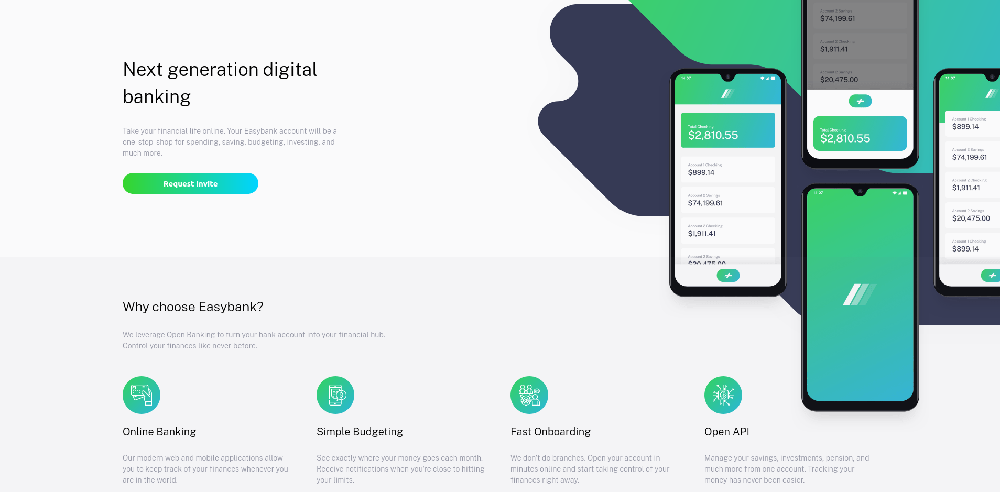
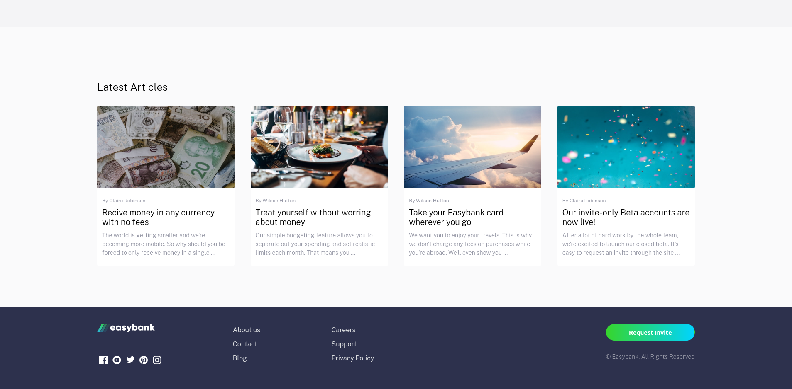
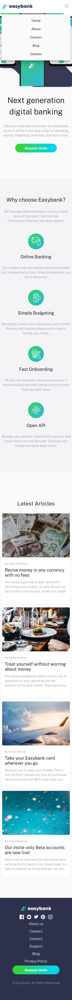

# Frontend Mentor - Easybank landing page solution

This is a solution to the [Easybank landing page challenge on Frontend Mentor](https://www.frontendmentor.io/challenges/easybank-landing-page-WaUhkoDN). Frontend Mentor challenges help you improve your coding skills by building realistic projects. 

## Table of contents

- [Overview](#overview)
  - [The challenge](#the-challenge)
  - [Screenshot](#screenshot)
  - [Links](#links)
- [My process](#my-process)
  - [Built with](#built-with)
- [Author](#author)

## Overview

### The challenge

Users should be able to:

- View the optimal layout for the site depending on their device's screen size
- See hover states for all interactive elements on the page

### Screenshot

#### Desktop

  
check

  
  

#### Mobile

  
check

  

### Links

- Solution URL: [live demo](https://zkindest.github.io/fe-c3-easybank-site/)

### Built with

- Semantic HTML5 markup
- CSS custom properties
- SCSS
- JavaScript

## Author
- Website - [Afroz](http://zkindest.github.io/)
- Frontend Mentor - [@zkindest](https://www.frontendmentor.io/profile/zkindest)
